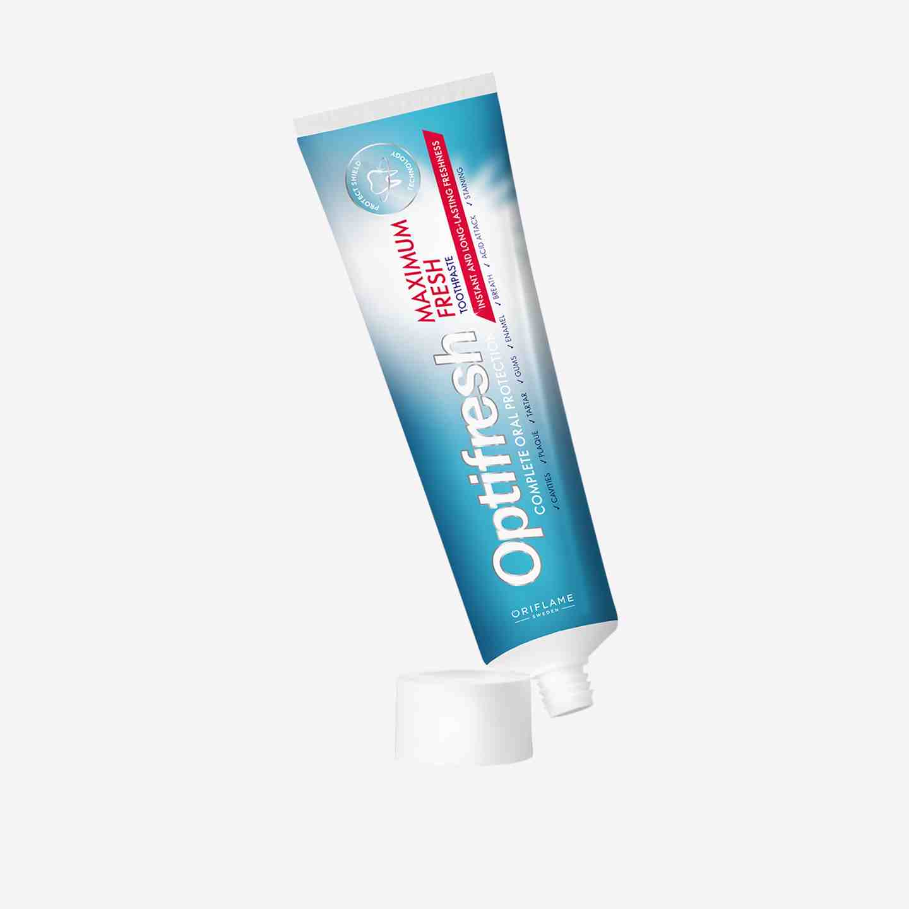

Prepare these two items. Remove any outer packaging.  
**A toothbrush** – an oral hygiene tool used to clean the teeth. It consists of a plastic handle about 12 cm (8 inches) long. On the one end of it, a head of tightly clustered bristles is mounted. A toothbrush is usually made of plastic and comes in various colours.    

**A tube of toothpaste** – a foldable package in the form of a cylindrical, hollow tube with a round or oval profile, usually made of plastic. On one end of the tube body there is a round opening closed with a screw-on cap. The other end is permanently sealed.  
The tube is filled with **toothpaste** – a soft cream-like substance used for oral hygiene.    
**A tube of toothpaste** – a foldable package in the form of a cylindrical, hollow tube with a round or oval profile, usually made of plastic. On one end of the tube body there is a round opening closed with a screw-on cap. The other end is permanently sealed.  
The tube is filled with **toothpaste** – a soft cream-like substance used for oral hygiene.    
  

1.	Take the tube of toothpaste in your dominant hand, the cap facing upwards. Place the cap between your thumb and the index finger of your other palm and turn it counterclockwise until loose.   
2. Then remove it and put where you can easily find it (eg. on the edge of the washbasin or in your pocket).
3. You may see a piece of foil placed over the opening. If there is one, tear it off and throw it away.
4. Put down the tube on the washbasin.
5. Take the toothbrush in your non-dominant hand, between the thumb and the index finger.
6. Now wet the toothbrush – place it under the tap and turn on water for a second. Turn off the water. Or rinse it in a cup of water.
7. Take the tube in your dominant hand again.
8. Hold the toothbrush horizontally, the head facing upwards.
9. Tilt the tube of toothpaste in the right hand so that it is placed diagonally to the toothbrush, and move it towards the toothbrush. The opening of the toothpaste tube should be approximately 1 inch above the head of the toothbrush. 
10. Now slowly and gently press the tube with the thumb and the index finger. It is the easiest to do it when you are holding the tube somewhere in the middle*).    
  
1.  A small amount of toothpaste will appear at the opening. Slide it along the brush - it will stick to the brush. The strain of toothpaste should be about 1 cm long.
2.  Put the head of the brush in your mouth.
3.  Now your hand is free – take the cap, place it on the opening of the toothpaste tube and turn clockwise to close it. Do not turn too tight.
4.  Hold the toothbrush holder with your dominant hand. You can start brushing your teeth.  
    *) When you have some practice, you can squeeze the tube at the place further towards its closed end. In this way, you will use the toothpaste more economically.

